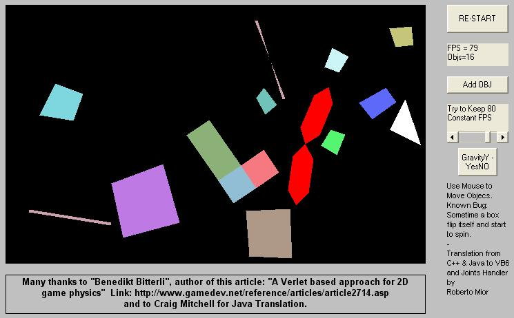



## BOXES V1\.2 \[OK\]

### Description

Verlet based approach for 2D game physics.

'Original C++ code written by Benedikt Bitterli Copyright (c) 2009 [The code is released under the ZLib/LibPNG license]

'Original C++ code and tutorial available at links http://www.gamedev.net/reference/programming/features/verletPhys/default.asp

'http://www.gamedev.net/reference/articles/article2714.asp

'Forum:

'http://www.gamedev.net/community/forums/topic.asp?topic_id=553845

'Conversion from C++ to Java done by Craig Mitchell Copyright (c) 2010.

'Conversion from "C++ & Java" to VB6 done by Roberto Mior Copyright (c) 2010.

'Joints Handler By Roberto Mior
 
### More Info
 

             |
---                |---
**Submitted On**   |2010-06-29 12:38:46
**By**             |[reexre](https://github.com/Planet-Source-Code/PSCIndex/blob/master/ByAuthor/reexre.md)
**Level**          |Intermediate
**User Rating**    |5.0 (15 globes from 3 users)
**Compatibility**  |VB 6\.0
**Category**       |[Games](https://github.com/Planet-Source-Code/PSCIndex/blob/master/ByCategory/games__1-38.md)
**World**          |[Visual Basic](https://github.com/Planet-Source-Code/PSCIndex/blob/master/ByWorld/visual-basic.md)
**Archive File**   |[BOXES\_V1\_22183906292010\.zip](https://github.com/Planet-Source-Code/reexre-boxes-v1-2-ok__1-73239/archive/master.zip)

